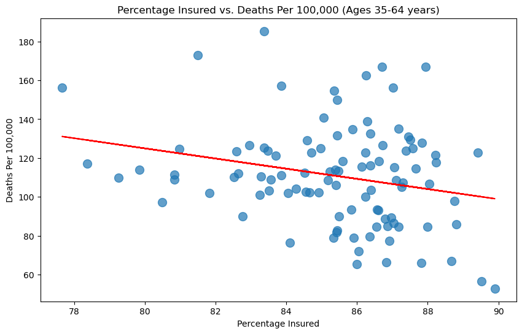
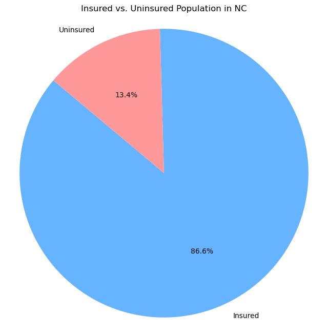
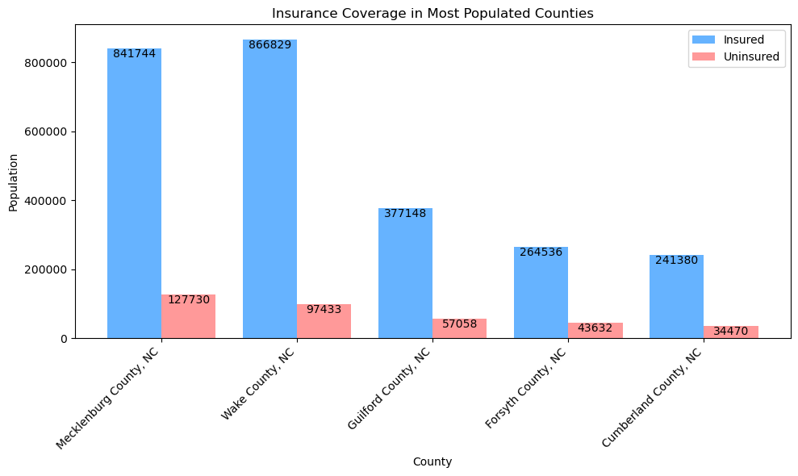
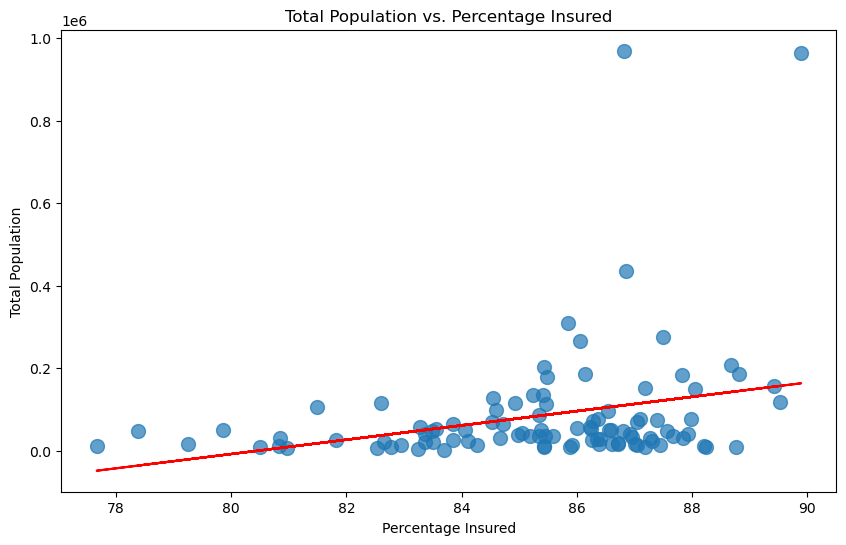

# Project-1: Impact of Insurance and Income on Heart Disease Mortality

## Team Members

- Abdulla Mashaly
- Elijah Reid
- Hannah Doby
- Rebecca Balderas

## Project Description

In this project, we researched the impact of insurance coverage on heart disease mortality in year 2019, in the state of North Carolina. Our research was based on data compiled from the Census Bureau and the Centers for Disease Control (CDC). We focused on understanding the relationship between health insurance coverage and income levels in relation to the poverty line and the relationship between health insurance coverage and heart disease mortality rates at the county level.

## Table of Contents

- Data Sources
    - Small Area Health Insurance Estimates (SAHIE) Program
    - Rates and Trends in Heart Disease and Stroke Mortality Among US Adults (35+) by County, Age Group, Race/Ethnicity, and Sex – 2000-2019
- Data Limitations
- Research Questions
- Data Retrieval and Cleaning
- Data Analysis and Visualization
    - Used Modules
    - Research Question 1
    - Research Question 2
    - Research Question 3
- Conclusion
## Data Sources

### Small Area Health Insurance Estimates (SAHIE) Program

The Small Area Health Insurance Estimates (SAHIE) program was created to develop model-based estimates of health insurance coverage for counties and states. This program builds on the work of the Small Area Income and Poverty Estimates (SAIPE) program. SAHIE is the only source of single-year health insurance coverage estimates.

SAHIE data can be used to analyze geographic variation in health insurance coverage, as well as disparities in coverage by race/ethnicity, sex, age and income levels that reflect thresholds for state and federal assistance programs. Because consistent estimates are available from 2008 to 2020, SAHIE reflects annual changes over time.
- Data Source <https://www.census.gov/programs-surveys/sahie/about.html>
- Terms os Service <https://www.census.gov/data/developers/about/terms-of-service.html>

### Rates and Trends in Heart Disease and Stroke Mortality Among US Adults (35+) by County, Age Group, Race/Ethnicity, and Sex – 2000-2019

This dataset documents rates and trends in heart disease and stroke mortality. Specifically, this report presents county (or county equivalent) estimates of heart disease and stroke death rates in 2000-2019 and trends during two intervals (2000-2010, 2010-2019) by age group (ages 35–64 years, ages 65 years and older), race/ethnicity (non-Hispanic American Indian/Alaska Native, non-Hispanic Asian/Pacific Islander, non-Hispanic Black, Hispanic, non-Hispanic White), and sex (women, men). The rates and trends were estimated using a Bayesian spatiotemporal model and a smoothed over space, time, and demographic group. Rates are age-standardized in 10-year age groups using the 2010 US population. 
- Data source: National Vital Statistics System <https://data.cdc.gov/Heart-Disease-Stroke-Prevention/Rates-and-Trends-in-Heart-Disease-and-Stroke-Morta/7b9s-s8ck>

## Data Limitations

1. **Sample Size and Coverage:** The data used in this analysis is based on specific sources, such as the Census Bureau and the Centers for Disease Control (CDC), which may have limitations in terms of sample size and geographical coverage. Consequently, some counties or regions may have limited or missing data, which could impact the generalizability of the findings.

2. **Data Quality and Completeness:** Data quality vary across our two sources of data. In the SAHIE data, ages of 65 and over are not included, as most people ages 65 and over are covered by Medicare or Supplemental Security Income (SSI). According to recent CPS ASEC data, less than 2 percent of the 65+ population were uninsured nationwide. In the Mortality data, ages below 35 are not icluded in the dataset. We have taken steps to clean and preprocess the data, but some inaccuracies may still persist.

3. **Temporal Scopes:** The data used in this project only covers year 2019. It's important to note that trends and patterns may have changed over time.

4. **Causation vs. Correlation:** While our analysis explores relationships between income, insurance coverage, and heart disease mortality, it is essential to understand that correlation does not imply causation. Other factors may influence those relationships.

## Research Questions

- If an individual has insurance, are they less likely to die from heart disease?

- Is an individual in a higher income bracket more likely to be insured?

- Does the total population in a given county coorelate with the amount of individuals insured?

## Data Retieval and Cleaning

In **census_data.ipynb** notebook, The Census data is obtained through an API request to the Census Bureau's API, specifically the Small Area Health Insurance Estimates (SAHIE) dataset. The API request fetches insurance-related data for the year 2019 for all counties in North Carolina. The retrieved data is converted into a Pandas DataFrame, where the columns are appropriately renamed for clarity. Unused columns and rows are dropped, and the DataFrame is further cleaned and organized.

The insured and uninsured populations are calculated for different age categories and income categories within each county. The data is then aggregated into two new DataFrame, clean_insurance_by_age and clean_insurance by_income containing information on the number of insured and uninsured individuals for various age and income categories in each county. Then, The percentages of insured and uninsured populations are calculated based on the aggregated data.

In **mortality_data.ipynb** notebook, data related to heart disease mortality in North Carolina counties is retrieved from the CDC (Centers for Disease Control) endpoint, and then the data is cleaned and prepared for analysis.

## Data Analysis and Visualization
### Used Modules:
- Pandas
- Numpy
- Matplotlib
- Requests
- JSON
- Scipy
- Geopandas
- Hvplot
## 1. In our first research question, we examine the correlation between health insurance coverage and mortality rates of heart disease through the following:

### Percentage of Insured Population per County

In this section, we present the data visualization of the percentage of insured population in each county of North Carolina. The visualization showcases the geographic distribution of insurance coverage across the counties, providing valuable insights into the variation of insured population percentages. The interactive heatmap plot uses a color gradient (cmap="YlOrRd") to represent the range of insurance coverage percentages. Counties are colored according to their respective percentage of insured population, and hovering over a county displays additional information, including the county name and the corresponding percentage of insured population. This data visualization offers an intuitive and geospatial perspective of insurance coverage, helping us identify regions with varying levels of insured population percentages.

### Mortality Rates per County
A geographical map was used to provide a visual representation of heart disease mortality rates across North Carolina counties. Warmer colors indicate higher mortality rates, while cooler colors represent lower rates.

By examining both geographic plots side by side, we can visually notice that there is some correspondence betweem ares with higher insurance coverage and lower heart disease mortality rates. but still we can find counties with high insurance coverage and high heart disease mortality rates and vice versa so we will have to further investigate this relationship in order to determine whether there is a correlation between these two variables.
### Correlation analysis
In this section, the percentage of insured population and heart disease mortality rates for individuals are merged and analyzed to explore the potential relationship between insurance coverage and heart disease mortality.a scatter plot was created to visualize the relationship between the percentage of insured population and heart disease mortality rates. The x-axis represents the "Percentage Insured" and the y-axis represents "Deaths Per 100,000". also, a linear regression line is added to observe any potential trend in the data.

Based on the results, the correlation between the per county mortality rate and per county percentage of insured population in North Carolina is approximately -0.24. A correlation coefficient of -0.24 indicates that there is some negative linear association between the two variables, but the strength of the relationship is not very strong. This means that as the percentage of Insured population of a county increases, there tends to be a slight tendency for heart disease mortality rate to deccrease. However, the relationship is not strong enough to make definitive conclusions solely based on this correlation.

---
## 2. The second question was trying to determine if there is a correlation between the income categories and the health insurance coverage

### Outliers Analysis and Boxplot Visualization
An outlier analysis was performed on the percentage of insured population data based on income categories. The goal is to identify potential outliers in the dataset using the Interquartile Range (IQR) method. This outlier analysis provides a quantitative assessment of data points that deviate significantly from the typical range, allowing for further investigation and consideration of their impact on the analysis results. 

Outliers per income category were: 
- Over 400% of Poverty's: 88.239816, 89.349112, 87.489556, 84.823529
- 250% to 400% of Poverty's: 82.793585, 80.189093, 82.531146, 78.733572
- 200% to 250% of Poverty's: 75.079940, 87.778861, 76.111003, 75.170843

Thes information was visualized through a box plot, The box plot allow for a clear comparison of the spread and central tendencies of the insurance coverage percentages for each income category. We can make an observation that there appears to be a trend of higher insurance coverage percentages for higher income categories. However, we run a T-Test to make a statistical comparison between income and health insurance coverage.

### T-Test for Health Insurance Coverage and Income
This test compares the percentage of insured population between two income categories: "Over 400% of Poverty" and "Under 138% of Poverty.", and allows for a statistical comparison of the means of the percentage insured between these two income groups.
Alternative hypothesis: The lower income population is less likely to be health insured.
Null hypothesis: Income levels have no affect on percentage of population with health insurance coverage.

Based on the t-test results, The **t-statistic** is approximately 38.28. This value represents the difference in means between the two groups, taking into account the variation within each group. The **p-value** is approximately 1.17e-80. This p-value is extremely small, essentially being zero. With such a small p-value, we can confidently reject the null hypothesis. The null hypothesis assumes that there is no significant difference between the percentage of insured population for high-income and low-income individuals. However, the extremely low p-value suggests strong evidence that there is a statistically significant difference in insurance coverage between these two income groups.

---

## 3. In the third Question, we examined the correlation between the population and the percenatage of people insured per county.
### Pie Chart
First, we plotted the whole insured versus uninsured population, the chart shows that 86.6% of North Carolina's populationis insured against 13.4% uninsured.

### Bar Charts for Top and Bottom Five Populated Counties
From these two plots we can observe that the insured population is significantly higher than uninsured population in the top five populated counties and the bottom five populated counties
 
### Scatter Plot for Total Population vs Percenatage Insured Per County
A scatter plot was generated to explore the relationship between the percentage of insured population and the total population in North Carolina counties.this visualization allows you to examine each county's total population against its corresponding percentage of insured population. Additionally, a linear regression line is added to observe any potential trend in the data.

Based on the results, the correlation between the per county total population and per county percentage of insured population in North Carolina is approximately 0.29. A correlation coefficient of 0.29 indicates that there is some positive linear association between the two variables, but the strength of the relationship is not very strong. This means that as the total population of a county increases, there tends to be a slight tendency for the percentage of insured population to increase as well. However, the relationship is not strong enough to make definitive conclusions solely based on this correlation.

## Conclusion
1. Referring to the two geographical maps of the NC counties that show the percent insured by county and mortality numbers by county respectively, it is clear that the “darker colored” counties on the mortality map, are more than probably shown on the percent insured map as “lighter colors” but this is not the case in all counties. So, A scatter plot with a line of regression was created as well, that shows a weak negative correlation between percent insured and mortality, with an r value of -0.24. So, with the data given, there is not enough to prove that if an individual has insurance, that they are less likely to die from heart disease.

2. We measured the central tendency of the insurance coverage percentages for each income category and created a box and whisker plot, in addition to t-test. The t-test produced a p-value of less than 0.05, which demonstrates that the two measures have statistical significance to each other, so valuable insight can be gathered from further analysis. Then, the box and whisker plot showed that the mean of the insured percentage increases as the income increases. So we were able to come to the conclusion that yes, an individual with a higher income bracket is more likely to be insured.

3. As a whole, the percentage of the insured population of North Carolina is significantly higher than then uninsured percentage, which is reflected in the pie chart. It still made us question if the counties with the higher population tended to have a higher percentage of insured individuals. With such a big dataset, we created visualizations for just the top five most populated counties and the bottom five least populated counties. With the bar charts created, there isn’t much correlation between population and percentage insured, if any. So to dig a little deeper, we created a scatterplot with a line of regression. The scatter plot shows minor correlation, and the r value calculated was 0.29, which is regarded as a weak correlation. With all these findings, we have concluded that while there is a weak correlation between the county population and the insured percentage, it isn’t enough to demonstrate significance.